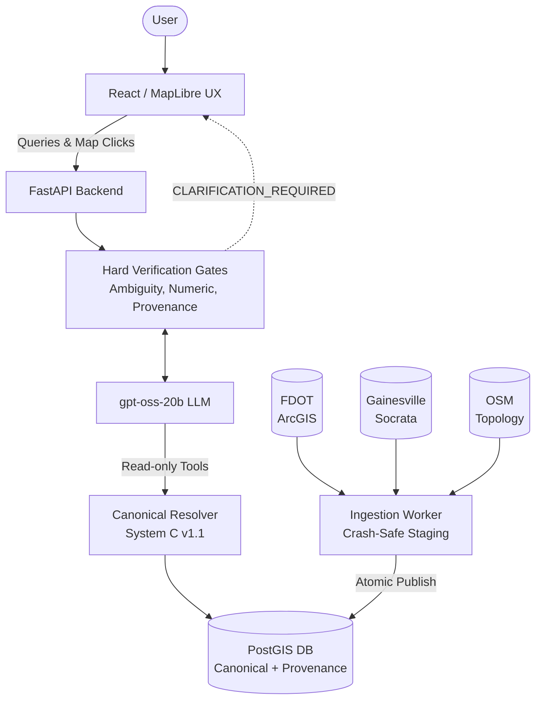

# TransGIS Architecture

```mermaid
flowchart TD
    %% Users & Interfaces
    User([User])
    UI[React / MapLibre UX]
    
    %% API & Orchestration
    FastAPI[FastAPI Backend]
    Agent[gpt-oss-20b LLM]
    Gate[Hard Verification Gates\nAmbiguity, Numeric, Provenance]
    
    %% Data Layer
    Canonical[Canonical Resolver\nSystem C v1.1]
    PostGIS[(PostGIS DB\nCanonical + Provenance)]
    
    %% Ingestion Pipeline
    Worker[Ingestion Worker\nCrash-Safe Staging]
    
    %% Source Systems
    FDOT[(FDOT\nArcGIS)]
    Gainesville[(Gainesville\nSocrata)]
    OSM[(OSM\nTopology)]

    %% Flow
    User --> UI
    UI -->|Queries & Map Clicks| FastAPI
    
    FastAPI --> Gate
    Gate <--> Agent
    Agent -->|Read-only Tools| Canonical
    Canonical --> PostGIS
    
    FDOT --> Worker
    Gainesville --> Worker
    OSM --> Worker
    Worker -->|Atomic Publish| PostGIS
    
    %% Clarification flow
    Gate -.->|CLARIFICATION_REQUIRED| UI
```
